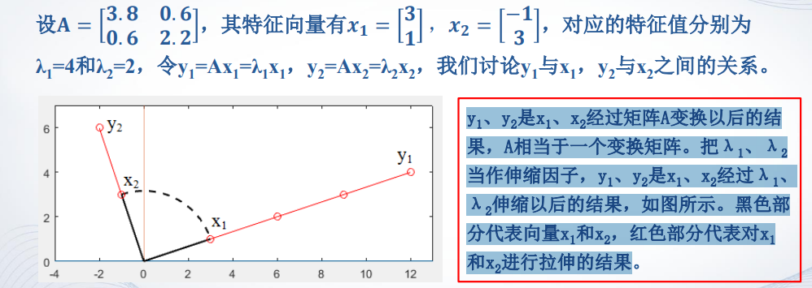

## 第二章 矩阵处理

### 2.1 特殊矩阵

#### 通用性的特殊矩阵

- `zeros`函数： 产生全0矩阵，即零矩阵
  - `zeros(m,n)`：产生m×n零矩阵。 
  - `zeros(size(A))`：产生与矩阵A同样大小的零矩阵。
- `ones`函数：产生全1矩阵，即幺矩阵。 
- `eye`函数：产生对角线为1的矩阵。当矩阵是方阵时，得到一个单位矩阵。 
- `rand`函数：产生（0，1）区间均匀分布的随机矩阵。 
- `randn`函数：产生均值为0，方差为1的标准正态分布随机矩阵 


#### 用于专门学科的特殊矩阵

- 魔方矩阵 

  - n阶魔方阵由`1,2,3,…,n^2`共n 2个整数组成，**且每行、每列以及 主、副对角线上各n个元素之和都相等。** 
  - n阶魔方阵每行每列元素的和为`(1+2+3+…+ n^2)/n=(n+n^3)/2 `
  - n>2时有很多不同的n阶魔方阵，MATLAB函数`magic(n)`产生一个 **特定**的魔方阵 

- 范德蒙矩阵 

  - 范德蒙（Vandermonde）矩阵是法国数学家范德蒙提出的一种特殊矩阵。范得蒙 矩阵的最后一列全为1，即向量v各元素的零次方，倒数第二列为指定的向量v， 即向量v各元素的一次方， 其他各列是其后列与倒数第二列的点乘积 

    

  - 形式`vander(m:n)` 从m 到 n的行列式

- 希尔伯特矩阵

  

  - 形式`hilb(n) `其中 n 表示矩阵的阶数

- 伴随矩阵

  形式 `compan(p)` 其中`p`是一个多项式的系数向量

  伴随矩阵的特征值就是多项式方程的根

- 帕斯卡矩阵

  - 根据二项式定理，`(x+y) ^n`展开后的系数随着n的增大组成一个三角形表，这个 三角形称为杨辉三角形。 
  - 把二项式系数依次填写在矩阵的左侧对角线上，然后提取左侧的n行n列元素 即为n阶帕斯卡（Pascal）矩阵 
  - 帕斯卡矩阵的第一行元素和第一列元素都为1，其余位置的元素是该元素的左边 元素与上面元素相加，即`P(i,j)=P(i,j-1)+P(i-1,j)`，且`P(i,1)=1,P(1,j)=1`


### 2.2矩阵变换

#### 对角阵

- 对角阵：只有对角线上有非零元素的矩阵

  - `diag(A)`提取矩阵A的主对角元素，产生一个列向量
    ```
    A = [4,4,4;4,4,4;4,4,4];
    B = diag(A)
    ```

  - `diag(V)`产生以向量V为主对角元素，产生对角矩阵

- 数量矩阵：对角线上的元素相等的对角矩阵 

- 单位矩阵：对角线上的元素都为1的对角矩阵 

#### 三角阵

- 上三角阵：矩阵的对角线以下的元素全为零的矩阵 
  - `triu(A)`提取矩阵A主对角线及以上的元素
  - `triu(A,k)`提取矩阵A的第K条对角线及以上的元素
- 下三角阵：对角线以上的元素全为零的矩阵。 
  - 下三角矩阵`tril(A,k)`生成下三角矩阵

#### 矩阵的转置

- 转置运算符是小数点后面接单引号  `.'`
- 共轭转置，其运算符是单引号  `'`，它在转置的基础上还要取每个数的复共轭 

#### 矩阵的旋转

- `rot90(A,k)`将矩阵A逆时针方向旋转90°的k倍，当k为1时可以省略。

#### 矩阵的翻转

对矩阵实施左右翻转是将原矩阵的第一列和最后一列调换，第二列和倒数第 二列调换，…，依此类推

- `fliplr(A)`：对矩阵A实施左右翻转 
- `flipud(A)`：对矩阵A实施上下翻转 

#### **矩阵求逆**

对于一个方阵A，如果存在一个与其同阶的方阵B，使得`AB=BA=I` (I为单位 矩阵)，则称B为A的逆矩阵，当然，A也是B的逆矩阵。 

- `inv(A)`：求方阵A的逆矩阵。 

### 2.3 矩阵求值

#### 矩阵的行列式值

把一个方阵看作一个行列式，并对其按行列式的规则求 值，这个值就称为所对应的行列式的值。 

- `det(A)` 求出方阵A的对应的行列式的值

#### 矩阵的秩

矩阵线性无关的行数或列数称为矩阵的秩。 

- `rank(A)`矩阵的秩

#### 矩阵的迹

矩阵的迹等于矩阵的对角线元素之和，也等于矩阵的特征值之和。 

- `trace(A)`：求矩阵A的迹 

#### 向量矩阵的范数

矩阵或向量的范数用来度量矩阵或向量在某种意义下的 **长度**。 

1. 向量的3中常见范数

   - 向量1—范数：向量元素的绝对值之和。 

     `norm(V，1)`

   - 向量2—范数：向量元素绝对值的平方和的平方根 

     `norm(V,2)`或者 `norm(V)` 

   - 向量∞—范数：所有向量元素绝对值中的最大值 

     `norm(V,inf)`

2. 矩阵的三种常见的范数

   - 矩阵A的1—范数：所有矩阵列元素绝对值之和的最大值。 
   - 矩阵A的2—范数：A'A矩阵的最大特征值的平方根。 
   - 矩阵A的∞—范数：所有矩阵行元素绝对值之和的最大值 

   调用格式跟上面的情况完全相同

#### 矩阵的条件数

- 矩阵A的条件数等于A的范数与A的逆矩阵的范数的乘积。 

  条件数**越接近于1**，矩阵的性能越好，反之，矩阵的性能越差。 

- 格式一般情况下:

  - `cond(A,1)`计算A的1—范数下的条件数 
  - `cond(A)或cond(A,2)`:计算A的2—范数数下的条件数。 
  - `cond(A,inf)`：计算A的∞—范数下的条件数 

### 2.4 矩阵的特征值与特征向量

#### 矩阵特殊值的数学定义

设A是n阶方阵，如果存在常数λ和n维非零列向量x，使得等式Ax=λx 成立，则称λ为A的特征值，x是对应特征值λ的特征向量。 

#### 求矩阵的特征值和特征向量

在MATLAB中，计算矩阵的特征值和特征向量的函数是eig，常用的调用格式 有两种： 

- ` E=eig(A)`：求矩阵A的全部特征值，构成向量E。 
- `[X,D]=eig(A)`：求矩阵A的全部特征值，构成对角阵D，并产生矩阵X，X 各列是相应的特征向量。 

#### 特征值的几何意义



### 2.5 稀疏矩阵

#### 矩阵的存储方式

- 完全存储方式：将矩阵的全部元素按列存储
- 稀疏存储方式：只存储矩阵的非零元素的值及其位置，即行号和列号 

#### 稀疏存储方式的产生

- 完全存储方式与稀疏存储方式之间的转化 

  `A = sparse(S)`: 将矩阵S转化为稀疏存储方式的矩阵A

  `S = full(A)`:将矩阵A转化成为完全存储方式的矩阵S

- 直接建立稀疏存储矩阵

  - `sparse(m,n)`：生成一个m×n的所有元素都是零的稀疏矩阵。 

  - `sparse(u,v,S)`：其中u、v、S是3个**等长**的向量。S是要建立的稀疏存储矩阵的非零元素，u(i)、v(i)分别是S(i)的行和列下标 

  - 使用spconvert函数直接建立稀疏存储矩阵，其调用格式为： 

    `B = spconvert(A)`,其中，`A`为一个`m*3`或`m*4`的矩阵

    - `A(i,1)`表示第i个非零元素所在的行。 
    - `A(i,2)`表示 第i个非零元素所在的列 
    - `A(i,3)`表示第i个非零元素值的实部 
    - `A(i,4)`表示第i个非零元素值的虚部。

- 带状稀疏矩阵的稀疏存储 

  - 稀疏矩阵有两种基本类型：无规则结构的稀疏矩阵与有规则结构的稀疏矩阵。 
  - 带状稀疏矩阵就是一种十分典型的具有规则结构的稀疏矩阵，它是指 所有非零元素集中在对角线上的矩阵 
  -  `[B,d]=spdiags(A)`：从带状稀疏矩阵A中提取全部非零对角线元素赋给矩阵B 及其这些非零对角线的位置向量d。 
  - `A=spdiags(B,d,m,n)`：产生带状稀疏矩阵的稀疏存储矩阵A，其中m、n为原 带状稀疏矩阵的行数与列数，矩阵B的第i列即为原带状稀疏矩阵的第i条非 零对角线，向量d为原带状稀疏矩阵所有非零对角线的位置。 

- 单位矩阵的稀疏存储
  `speye(m,n)`返回一个m×n的稀疏存储单位矩阵。  

