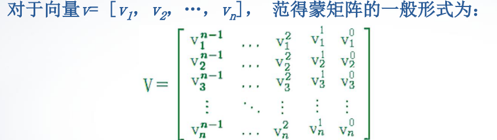
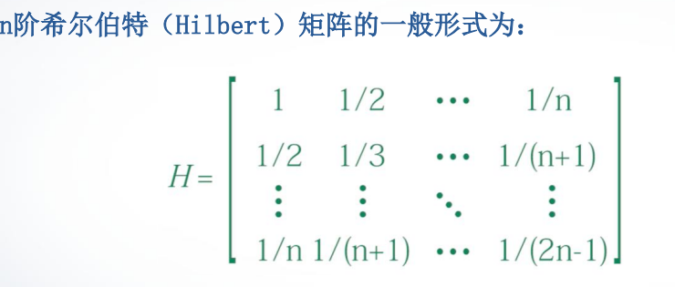
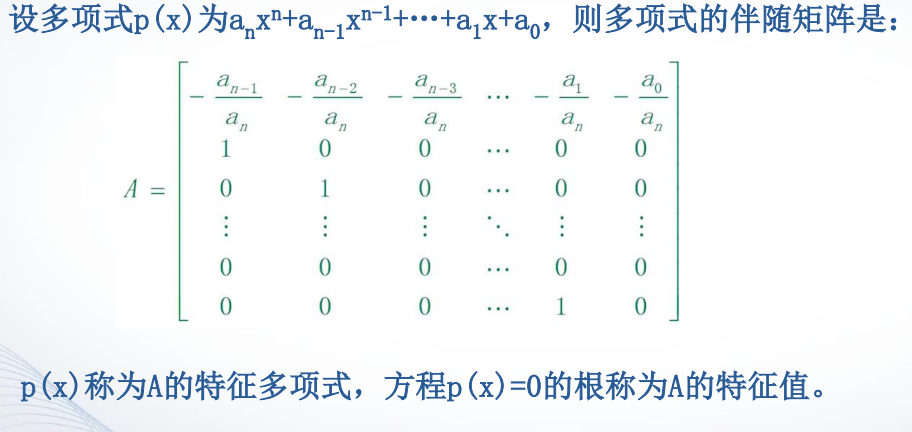
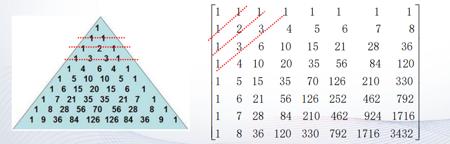

## 第二章 矩阵处理

### 2.1 特殊矩阵

- 通用性的特殊矩阵
  - `zeros`函数： 产生全0矩阵，即零矩阵
    - `zeros(m,n)`：产生m×n零矩阵。 
    - `zeros(size(A))`：产生与矩阵A同样大小的零矩阵。
  - `ones`函数：产生全1矩阵，即幺矩阵。 
  - `eye`函数：产生对角线为1的矩阵。当矩阵是方阵时，得到一个单位矩阵。 
  - `rand`函数：产生（0，1）区间均匀分布的随机矩阵。 
  - `randn`函数：产生均值为0，方差为1的标准正态分布随机矩阵 

- 用于专门学科的特殊矩阵

  - 魔方矩阵 

    - n阶魔方阵由`1,2,3,…,n^2`共n 2个整数组成，**且每行、每列以及 主、副对角线上各n个元素之和都相等。** 
    - n阶魔方阵每行每列元素的和为`(1+2+3+…+ n^2)/n=(n+n^3)/2 `
    - n>2时有很多不同的n阶魔方阵，MATLAB函数`magic(n)`产生一个 **特定**的魔方阵 

  - 范德蒙矩阵 

    - 范德蒙（Vandermonde）矩阵是法国数学家范德蒙提出的一种特殊矩阵。范得蒙 矩阵的最后一列全为1，即向量v各元素的零次方，倒数第二列为指定的向量v， 即向量v各元素的一次方， 其他各列是其后列与倒数第二列的点乘积 

      

    - 形式`vander(m:n)` 从m 到 n的行列式

  - 希尔伯特矩阵

    

    - 形式`hilb(n) `其中 n 表示矩阵的阶数

  - 伴随矩阵

    形式 `compan(p)` 其中`p`是一个多项式的系数向量

    伴随矩阵的特征值就是多项式方程的根

  - 帕斯卡矩阵

    - 根据二项式定理，`(x+y) ^n`展开后的系数随着n的增大组成一个三角形表，这个 三角形称为杨辉三角形。 
    - 把二项式系数依次填写在矩阵的左侧对角线上，然后提取左侧的n行n列元素 即为n阶帕斯卡（Pascal）矩阵 
    - 帕斯卡矩阵的第一行元素和第一列元素都为1，其余位置的元素是该元素的左边 元素与上面元素相加，即`P(i,j)=P(i,j-1)+P(i-1,j)`，且`P(i,1)=1,P(1,j)=1`

    

    

