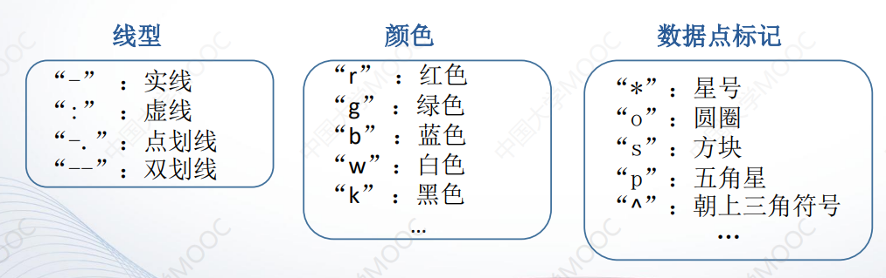

# 专题四 MATLAB 绘图

## 二维曲线

### `plot`函数

- 基本用法: `plot(x,y)` 其中 x 和 y 分别用于存储 x 坐标和y坐标数据 

- 最简单的`plot`函数调用格式: plot(x) 将序号作为横坐标，值作为纵坐标

  当plot函数的参数x是复数向量时，则分别以该 向量元素实部和虚部为横、纵坐标绘制出一条曲线。 

- plot(x, y)函数参数的变化形式 

  - 当x是向量，y是矩阵时 
    - 如果矩阵y的列数等于x的长度，则以向量x为横坐标，以y的每个 行向量为纵坐标绘制曲线，曲线的条数等于y的行数 
    - 如果矩阵y的列数等于x的长度，则以向量x为横坐标，以y的每个 行向量为纵坐标绘制曲线，曲线的条数等于y的行数 
  -  当x、y是同型矩阵时 
    - 以x、y对应列元素为横、纵坐标分别绘制曲线，曲线条数等于 矩阵的列数 

- 含多个输入参数的plot函数 `plot(x1, y1, x2, y2, …, xn, yn) `

  其中，每一向量对构成一组数据点的横、纵坐标，绘制一条曲线 

- 含选项的plot函数 `plot(x,y,选项)`

  

### `fplot`函数

- fplot函数的基本用法 :`fplot(f,lims,选项)`

  其中，f代表一个函数，通常采用函数句柄的形式。lims为x轴的 取值范围，用二元向量`[xmin，xmax]`描述，默认值为`[-5, 5]`。选项定 义与plot函数相同 

- 双输入函数参数的用法 `fplot(funx, funy, tlims, 选项) `

  其中，`funx、funy`代表函数，通常采用函数句柄的形式。`tlims`为 参数函数`funx`和`funy`的自变量的取值范围，用二元向量`[tmin，tmax]` 描述 。 

## 绘制图形的辅助操作

### 给图形添加标注

- `title`函数

  - `title(图形标题)`

  - 在图形标题中使用`LaTeX`格式控制符 

    受`LaTeX`格式控制的部分要用大括号括起来。 

  - 含属性设置的title函数 

    `title(图形标题，属性名，属性值) `

    - `Color`属性：用于设置图形标题文本的颜色
    - `FontSize`属性：用于设置标题文字的字号

- `xlabel`函数和`ylabel`函数 

  `xlabel(x轴说明)`   `ylabel(y轴说明)`

- `text`函数和`gtext`函数 

  `text(x,y,说明)` 和 `gtext(说明)`

- `legend`函数

  `legend(图例1，图例2， ...)`

### 坐标控制

- `axis`函数

  基本用法：`axis([xmin,xmax,ymin,ymax,zmin,zmax])`

  其他用法:

  - `axis equal`：纵、横坐标轴采用等长刻度 
  -  `axis square`：产生正方形坐标系(默认为矩形) 
  - `axis auto`：使用默认设置 
  - `axis off`：取消坐标轴 
  - `axis on`：显示坐标轴 

- `grid`函数

  - `grid on`
  - `grid off`
  - `grid`

- `box`函数

  - `box on`
  - `box off`
  - `box`

### 图形保持

- `hold on `
- `hold off`
- `hold`

### 图形窗口的分割

- 子图：同一图形窗口中的不同坐标系下的图形称为子图。 

- `subplot(m, n, p)`

  其中, m 和 n 指定将图形窗口分成 m*n 个绘图区， p 指定为当前活动区

## 其他形式的二维曲线

### 其他坐标系下的二维曲线图

- 对数坐标图

  ```matlab
  semilogx(x1, y1, 选项1, x2, y2, 选项2, …)
  semilogy(x1, y1, 选项1, x2, y2, 选项2, …)
  loglog(x1, y1, 选项1, x2, y2, 选项2, …)
  ```

  其中，`semilogx`函数x轴为常用对数刻度，y轴为线性刻度

  `semilogy`函数x轴为线性刻度，y轴为常用对数刻度

  `loglog`函数x轴和y轴均采用常用对数刻度 

- 极坐标图

  `polar(theta, rho,选项)` 其中，`theta`为极角，`rho`为极径，选项内容与`plot`函数相同

### 统计图

- 条形图
- 直方图
- 饼图
- 散点图

### 矢量图形