## Unit 1 Recurrent Problems

### 1.1 The Tower of Hanoi 汉诺塔问题

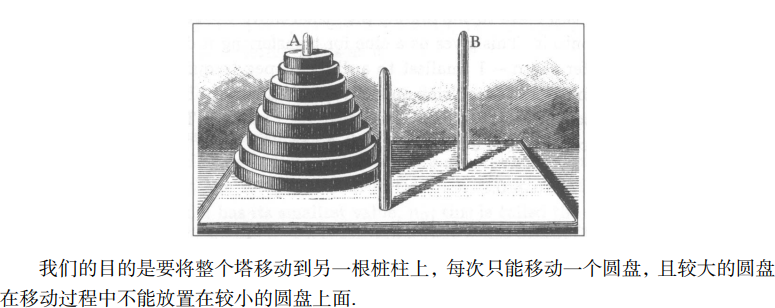

我们可以得到一个解：

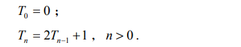

像这样的式子可以称作**递归式(recurrence)**,它给出一个边界值，并且可以用前面的值给出一般值。并且我们可以用数学归纳法进行计算这样一个式子，从而得到封闭形式的解。

**数学归纳法（mathematical induction）**：

- 我们在$n$取最小值$n_0$时证明该命题 （**basis**）
- 对$n>n_0$的情况，假设该命题对$n_0$到$n-1$之间所有结果已经被证明
- 再证明该命题对`n`成立即可 (**induction**)

从而我们总结出求解递归式等问题的典范，寻求封闭形式的表达式：

- 研究小的情形．这有助于我们洞察该问题，而且对第二和第三阶段有所帮助 
- 对有意义的量求出数学表达式并给出证明
- 对数学表达式求出封闭形式并予以证明．

### 1.2 平面上的直线

本质问题：平面上 n 条直线所界定的区域的最大个数 L(n) 是多少？ 

我们再次从研究小的范围的问题着手，比如

| **n**    | 0    | 1    | 2    | 3    |
| -------- | ---- | ---- | ---- | ---- |
| **L(n)** | 1    | 2    | 4    | 7    |

略加思考之后，我们给出适当的推广．第 n （ n > 0 ）条直线使得区域的个数增加 k 个， 当且仅当它对 k 个已有区域进行了分裂；而它对 k 个已有区域进行分裂，当且仅当它在 k > 1 个不同的地方与前面那些直线相交．两条直线**至多相交于一点**，因而这条新的直线与那 n >1 条已有直线至多相交于 n >1个不同的点，故必定有 **k < = n**  ． 从而得到上界：

进而得到递归式：

通过带入迭代求解可以得到

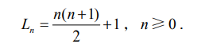

那么什么是封闭形式的运算呢？如果**可以利用至多固定次数**（其次数与 n 无关）的“人人熟知的”标准运算来计算量 f ( n ) 的表达式，那么这个表达式是封闭形式的。

现在我们讨论更深的形式，折线的形式：平面上由n条折线所界定的区域最大个数**Z(n)**是多少

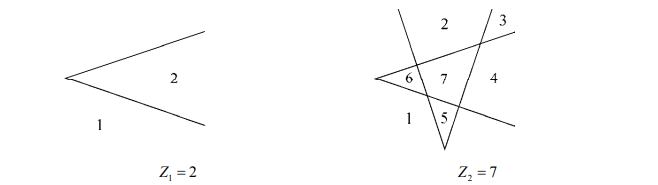

经过思考我们发现除了这“两条”直线不经过它们的交点，延伸出去而使得区域相融合之外，一条折线与两条直线相似： 

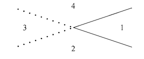

​	区域2、3和4对于两条直线来说它们是不同的区域，但在一条折线的情形下是单独的一个区 域，于是我们失掉了两个区域．然而，如果放置得当——锯齿点必须放在它与其他直线的交点 “之外”——那就是我们失去的全部，也就是说，对每条折线我们仅仅损失两个区域 .从而我们得到：

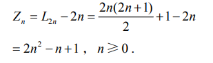

上述是一个重要的思想。

### 1.3 约瑟夫问题

问题描述：

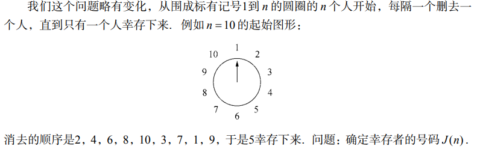

​	我们一开始假设有 2n 个人，经过第一轮之后，剩下的还有n个人，并且幸存的那位的序号是在剩下的这n个人中的两倍加一，即 **J(2n) = 2 * J(n) - 1**,我们紧接着考虑一开始有 2n-1 个人，那么最后2n-2被除去，再接下来就是一号，如此，同样变成偶数，在剩下的人中，显然有这样的关系 **J(2n+1) = 2 * J(n) + 1**，如上所述，我们得到了这样的递归式:

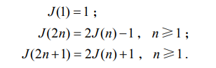

​	为了求得它的封闭形式的解，我们考虑列表找到规律：

|    n     |  1   |  2   |  3   |  4   |  5   |  6   |  7   |  8   |  9   |  10  |  11  |  12  |  13  |  14  |  15  |
| :------: | :--: | :--: | :--: | :--: | :--: | :--: | :--: | :--: | :--: | :--: | :--: | :--: | :--: | :--: | :--: |
| **J(n)** |  1   |  1   |  3   |  1   |  3   |  5   |  7   |  1   |  3   |  5   |  7   |  9   |  11  |  13  |  15  |

我们惊人的发现它的解是：

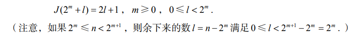

同时我们可以归纳证明上述解确实为递归式的解。

我们做推广有：

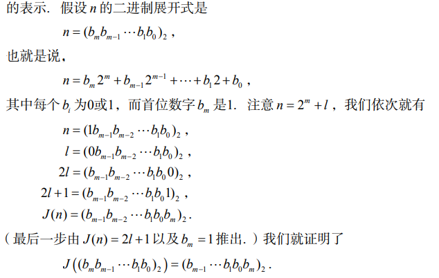

即，$n$向左循环移动以为就得到$J(n)$ ，当$0$成为首位时，迭代将无法进行下去。

#### 问题推广

如果我们在计算过程中真的出现了相像的递归式（不过有不同的常数），则我们引入$\delta .\alpha .\gamma$等常数来对递归式进行一个封闭形式的求解过程。即
$$
\left\{
	\begin{array}
		f(1) = \alpha \\
		f(2n)  = 2 f(n) + \beta, n>=1 \\
		f(2n+1) = 2f(n)  + \gamma , n>=1 \
	\end{array}
\right.
$$
我们进行初步的计算有：

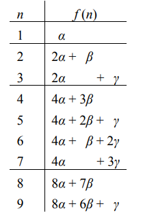

容易看出，$\alpha$的系数是2的整数倍，$\beta$的系数依次递减，$\gamma$的系数依次增加，于是将$f(n)$的形式拆开来看有
$$
f(n) = A(n)  \alpha+B(n)\beta+C(n)\gamma
$$
看起来有
$$
\begin{array}
	AA(n) = 2^m  \\
	B(n) = 2^m - 1- l \\
	C(n) = l
\end{array}
$$
上述结果显然可以用数学归纳法证明正确性。

同样可以计算出满足下述方程：
$$
\begin{array}
	AA(n) = 2^m , 其中 n = 2^m +l且0\le l < 2^m; \\
	A(n) - B(n) - C(n) = 1; \\
	A(n)+ C(n) = n
\end{array}
$$
