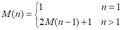
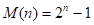

3.1 若按教科书3.1.1节中图3.1(b)所示铁道进行车厢调度（注意：两侧铁道均为单向行驶道），则请回答：


(1) 如果进站的车厢序列为123，则可能得到的出站车厢序列是什么？

> （1）123 231 321 213 132

(2) 如果进站的车厢序列为123456，则能否得到435612和135426的出站序列，并请说明为什么不能得到或者如何得到（即写出以‘S’表示进栈和以‘X’表示出栈的栈操作序列）。

> （2）可以得到135426的出站序列，其相应操作为：SXSSXSSXXXSX。不能得到435612的出站序列。因为4356出站说明12已经在栈中，1不可能先于2出栈。

3.2 简述栈和线性表的差别。

> 线性表是一组具有相同特性的数据元素的一个有限序列。栈是限定仅在表尾进行插入或删除操作的线性表。

3.3 写出下列程序段的输出结果（栈的元素类型SElemType为char）。

```
void main()
{
    Stack S;
    char x, y;
    InitStack(S);
    x = ’c’;
    y = ’k’;
    Push(S, x);
    Push(S, ‘a’);
    Push(S, y);
    Pop(S, x);
    Push(S,‘t’);
    Push(S, x);
    Pop(S, x);
    Push(S,‘s’);
    while(!StackEmpty(S))
    {
        Pop(S,y);
        printf(y);
    }
    printf(x);
}
```

> 输出结果：stack

3.4 简述以下算法的功能（栈的元素类型SElemType为int）。

**(1)**

```
status algo1(Stack S)
{
    int i, n, A[255];
    n=0;
    while(!StackEmpty(S))
    {
        n++;
        Pop(S, A[n]);
    }
    for(i=1; i<=n; i++)
        Push(S, A[i]);
}
```

> 栈中的数据元素逆置。

**(2)**

```
status algo2(Stack S,int e)
{
    Stack T;
    int d;
    InitStack(T);
    while(!StackEmpty(S))
    {
        Pop(S, d);
        if(d!=e)
            Push(T, d);
    }
    while(!StackEmpty(T))
    {
        Pop(T, d);
        Push(S, d);
    }
}
```

> 如果栈中存在元素e，将其从栈中删除。

3.5 假设以S和X分别表示入栈和出栈的操作，则初态和终态均为空栈的入栈和出栈的操作序列可以表示为仅由S和X组成的序列。称可以操作的序列为合法序列（例如，SXSX为合法序列，SXXS为非法序列）。试给出区分给定序列为合法序列或非法序列的一般准则，并证明：两个不同的合法（栈操作）序列（对同一输入序列）不可能得到相同的输出元素（注意：在此指的是元素实体，而不是值）序列。

> 区分准则：
> 任何前n个序列中S的个数一定不小于X的个数。
>
> 证明：
>
> 设两个合法序列为：
> T1 = S……X……S……
> T2 = S……X……X……
>
> 假定前n个操作都相同，从第n+1个操作开始，为序列不同的起始操作点。由于前n个操作相同，故此时两个栈（不妨为栈A、B）的存储情况完全相同，假设此时栈顶元素均为a。
>
> 第n+1个操作不同，不妨T1的第n+1个操作为S，T2的第n+1个操作为X。T1为入栈操作，假设将b压栈，则T1的输出顺序一定是先b后a；而T2将a退栈，则其输出顺序一定是先a后b。由于T1的输出为……ba……，而T2的输出顺序为……ab……，说明两个不同的合法栈操作序列的输出元素的序列一定不同。

3.6 试证明：若借助栈由输入序列12…n得到的输出序列为p1p2…pn(它是输入序列的一个排列)，则在输出序列中不可能出现这样的情形：存在着i<j<k使pj<pk<pi。

> 这个问题和3.1题比较相似。因为输入序列是从小到大排列的，所以若pj<pk<pi，则可以理解为通过输入序列pj，pk，pi可以得到输出序列pi，pj，pk，显然通过序列123是无法得到312的，参见3.1题。所以不可能存在着i<j<k使pj<pk<pi。

3.7 按照四则运算加、减、乘、除和幂运算(↑)优先关系的惯例，并仿照教科书3.2节例3-2的格式，画出对算术表达式 A-B×C/D+E↑F 求值时操作数栈和运算符栈的变化过程：

> 设：BC=G G/D=H A-H=I E^F=J I+J=K

| 步骤 | OPTR栈 | OPND栈  | 输入字符       | 主要操作         |
| ---- | ------ | ------- | -------------- | ---------------- |
| 1    | `#`    |         | `A-B*C/D+E^F#` | `PUSH(OPND,A)`   |
| 2    | `#`    | `A`     | `-B*C/D+E^F#`  | `PUSH(OPTR,-)`   |
| 3    | `#-`   | `A`     | `B*C/D+E^F#`   | `PUSH(OPND,B)`   |
| 4    | `#-`   | `A B`   | `*C/D+E^F#`    | `PUSH(OPTR,*)`   |
| 5    | `#-*`  | `A B`   | `C/D+E^F#`     | `PUSH(OPND,C)`   |
| 6    | `#-*`  | `A B C` | `/D+E^F#`      | `Operate(B,*,C)` |
| 7    | `#-`   | `A G`   | `/D+E^F#`      | `PUSH(OPTR,/)`   |
| 8    | `#-/`  | `A G`   | `D+E^F#`       | `PUSH(OPND,D)`   |
| 9    | `#-/`  | `A G D` | `+E^F#`        | `Operate(G,/,D)` |
| 10   | `#-`   | `A H`   | `+E^F#`        | `Operate(A,-,H)` |
| 11   | `#`    | `I`     | `+E^F#`        | `PUSH(OPTR,+)`   |
| 12   | `#+`   | `I`     | `E^F#`         | `PUSH(OPND,E)`   |
| 13   | `#+`   | `I E`   | `^F#`          | `PUSH(OPTR,^)`   |
| 14   | `#+^`  | `I E`   | `F#`           | `PUSH(OPND,F)`   |
| 15   | `#+^`  | `I E F` | `#`            | `Operate(E,^,F)` |
| 16   | `#+`   | `I J`   | `#`            | `Operate(I,+,J)` |
| 17   | `#`    | `K`     | `#`            | `RETURN`         |

3.8 试推导求解n阶梵塔问题至少要执行的move操作的次数。

> 设至少要执行M(n)次move操作，则
> [
> 解此方程可得 。

3.9 试将下列递推过程改写为递归过程。

```
void ditui(int n)
{
    int i;
    i = n;
    while(i>1)
        cout<<i--;
}
```

> 递归过程如下：
>
> void digui(int j)
> {
>     if(j>1)
>     {
>         cout<<j;
>         digui(j-1);
>     }
>     return;
> }

3.10 试将下列递归过程改写为非递归过程。

```
void test(int &sum)
{
  int x;
  cin>>x;
  if(x==0)
    sum=0;
  else
  {
    test(sum);
    sum+=x;
  }
  cout<<sum;
}
```

> 非递归过程如下：
>
> void test(int &sum)
> {
>     Stack s;
>     int x;
>     scanf(x);
>     InitStack(s);
>     while(x)
>     {
>         Push(S,x);
>         scanf(x);
>     }
>     sum=0;
>     printf(sum);
>     while(Pop(S,x))
>     {
>         sum +=x;
>         printf(sum);
>     }
> }

3.11 简述队列和堆栈这两种数据类型的相同点和差异处。

> 栈是一种运算受限的线性表，其限制是仅允许在表的一端进行插入和删除运算。
> 队列也是一种运算受限的线性表，其限制是仅允许在表的一端进行插入，而在表的另一端进行删除。

3.12 写出以下程序段的输出结果（队列中的元素类型QElemType为char）。

```
void main()
{
  Queue Q;
  InitQueue(Q);
  char x= ‘e’, y= ‘c’;
  EnQueue(Q, ‘h’);
  EnQueue(Q, ‘r’);
  EnQueue(Q, y);
  DeQueue(Q, x);
  EnQueue(Q, x);
  DeQueue(Q, x);
  EnQueue(Q, ‘a’);
  While(!QueueEmpty(Q))
  {
    DeQueue(Q,y);
    cout<<y;
  }
  cout<<x;
}
```

> 输出结果：char

3.13 简述以下算法的功能（栈和队列的元素类型均为int）。

```
void algo3(Queue &Q)
{
  Stack S;
  int d;
  InitStack(S);
  while(!QueueEmpty(Q))
  {
    DeQueue(Q, d);
    Push(S, d);
  }
  while(!StackEmpty(S))
  {
    Pop(S, d);
    EnQueue(Q, d);
  }
}
```

> 功能：利用栈的特长进行队列逆置。

3.14 若以1234作为双端队列的输入序列，试分别求出满足以下条件的输出序列：

(1) 能由输入受限的双端队列得到，但不能由输出受限的双端队列得到的输出序列。

(2) 能由输出受限的双端队列得到，但不能由输入受限的双端队列得到的输出序列。

(3) 既不能由输入受限的双端队列得到，也不能由输出受限的双端队列得到的输出序列。

> 注：输入顺序确定，但是输入输出的方式不定，可以边输入边输出。
>
> （1）4 1 3 2
> （2）4 2 1 3
> （3）4 2 3 1
>
> 提示：不要穷举所有输入输出，而是穷举1234可能组成的24种排列方式，然后对每一种排列方式校验看是否满足题意。