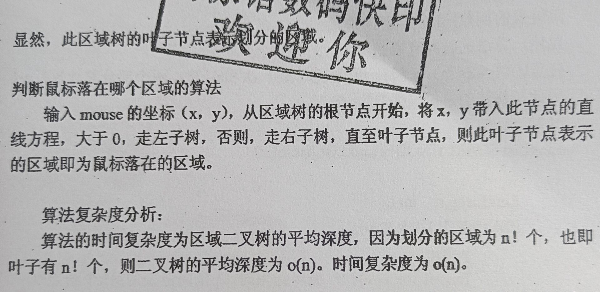
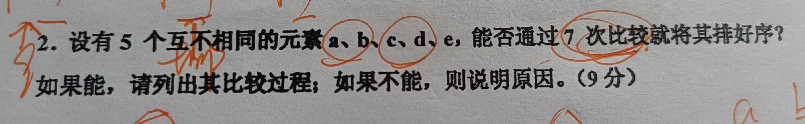
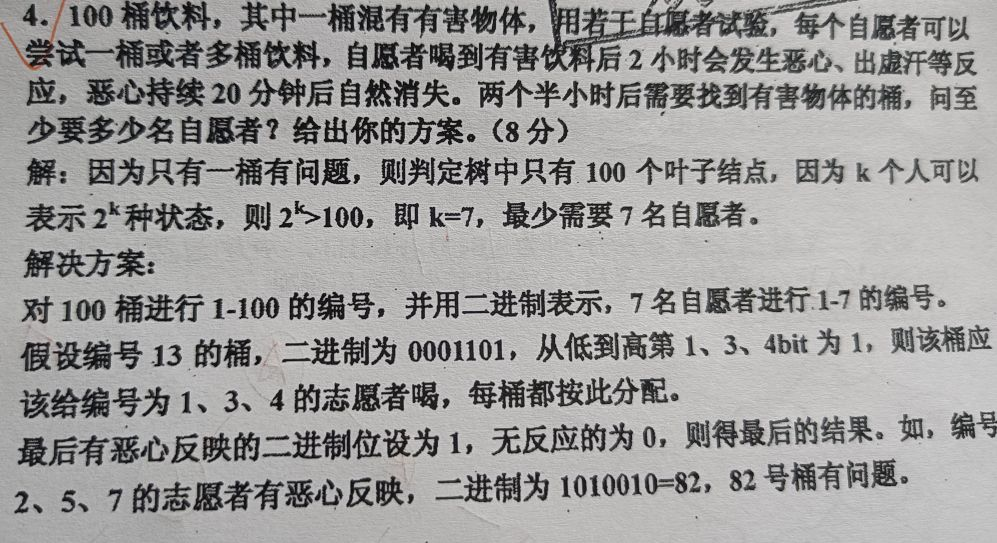
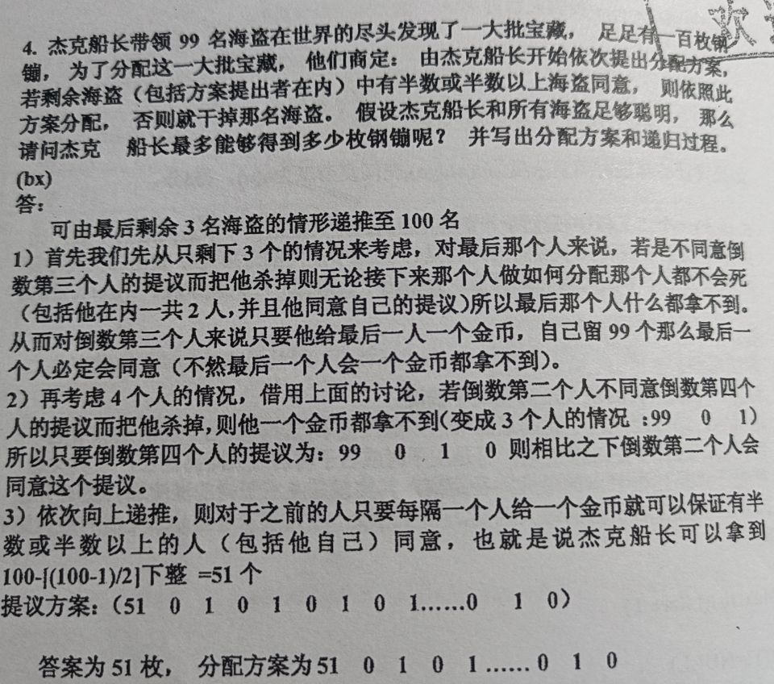

## 2008级

利用栈计算表达式 ((A-B)-C)-（D+(E-F)）的值，操作数栈和运算符栈的深度最小各是多少？

复习回顾一下求解表达式符的算法：

- 使用两个栈，`stack0`用于存储操作数，`stack1`用于存储操作符
- 从左往右扫描，遇到操作数入栈`stack0`
- 遇到操作符时，如果优先级低于或等于栈顶操作符优先级，则从`stack０`弹出两个元素进行计算，并压入`stack0`，继续与栈顶操作符的比较优先级
- 如果遇到操作符高于栈顶操作符优先级，则直接入栈`stack1`
- 遇到左括号，直接入栈`stack1`，遇到右括号，则直接出栈并计算，直到遇到左括号x 

## 2009级

- 次优二叉树生成之后，调整方案：

  **选取邻近的权值较大的关键字作为次优查找树的根节点（也就是左旋和右旋子树）** 

- `KMP`最坏时间复杂度是: `O(m+n)`

- 锦标赛排序算法:

  第一次比较次数为   `n-1 `  之后比较次数为   `ceil(log2n) ` 向上取整

## 2010级

- 表达式树生成方法：

  - 在遍历到操作数时建立新节点并将该节点压入操作数栈中。
  - 当操作符从操作符栈中出栈时为该操作符新建一个节点，并从操作数栈中pop出两个操作数节点，将第一个操作数节点作为新节点的右节点，第二个个作为左节点，之后将这个新节点压入操作数栈中。
  - 当最后一个操作符出栈时，就构成了二叉树，且最后一个操作符节点为根节点。

  出栈过程中，**遵循求解表达式值的操作符出栈顺序**

- 锦标赛排序中

  辅助空间需要  `n-1` 空间 空间复杂度是`O(n)`

- 

  首先考虑 a,b 和 c,d之间的大小，进行比较，不妨假设 a>b, c>d,那么将 a 同 c进行比较，如果 a > c，说明 a> c> d，则只需要将剩下的 b,e进行折半查找插入序列中即可，折半查找单次完成需要两次比较，总共加起来一共七次

## 2011级

- 有 n 个结点的二叉树采取顺序存储结构存储 ，**完全二叉树** 最节省存储空间， **单支右子树** 最浪费存储空间
- 查找不成功就是`dep[i]*(2-sum[i])` 其中 `dep[i]`表示树的深度， `sum[i]`表示子树个数
- 

## 2012级

- 堆排序过程：
  - 首先将堆中按照顺序画出树图
  - 将树图上面的点从`n/2`向上开始调整，如果出现数的转换，则需要向下调整到底端
  - 每一次排序，都需要将剩余的头号元素跟剩余的尾端元素互换，之后从上向下进行调整
- 如果二叉树中前序遍历跟后序遍历正好相反，则说明**树中没有度为2的点**
- 哈夫曼树中新生的结点放在队列后面，所以原来存在的结点先被选中
- 

## 2013级

- 三元组表第一行是: `n m v `表示 n行，m列，v个有效值
- **后序遍历**需要进栈**两次**，而**前序遍历**只需要**进栈一次**

## 2014级

- 哈夫曼树中**没有**度为1的点，这可以作为haffman树的判定方法
- 判断一个链表是否有环，确实可以用单双指针法，并且**相遇的位置距离环入口的距离同链表头距离环入口的距离相同**

## 2015级

- 设二叉树中有1000个结点，若采用二叉链表作为存储结构。该二叉树中共有**2000**个指针域，**1001**个空指针域

  一般情况下二叉链表的数据存储格式为 `lchild data rchild`并且根据公式 **树的结点数-1等于度之和等于指针域有值的数目**

## 2016级

- 静态链表的长度最开始已经确定不能再加入更改，但是插入的操作跟动态链表一样
- 快速排序越等分越好，速度越快

## 2018级

- 广义表表尾需要带**括号，**长度就是广义表中元素数目
- 小根堆插入需要考虑数据移动，复杂度为 `O(n)`