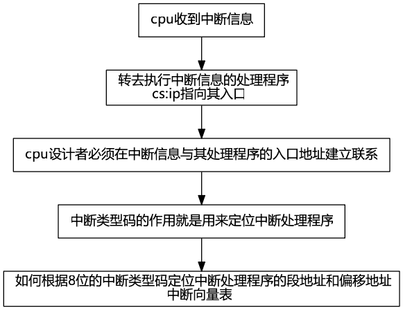
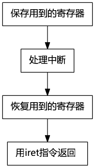
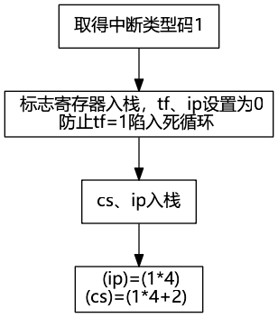
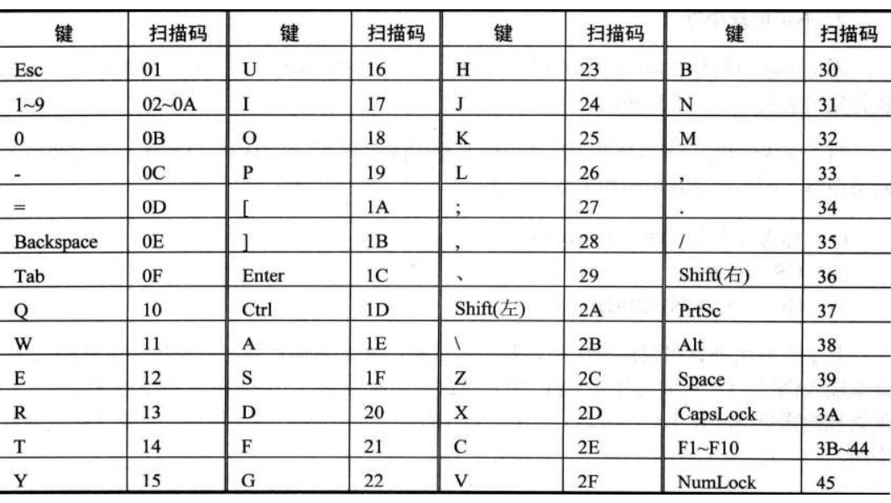
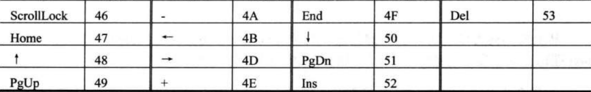
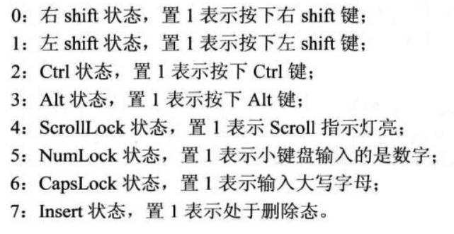
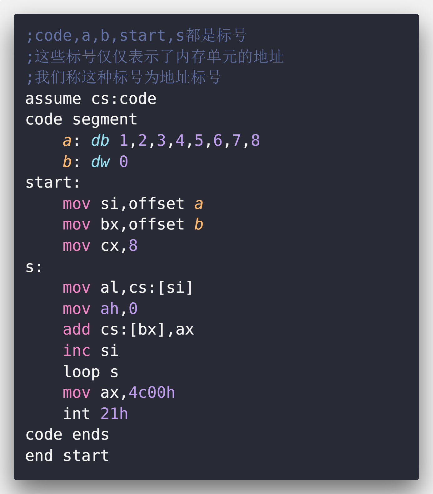
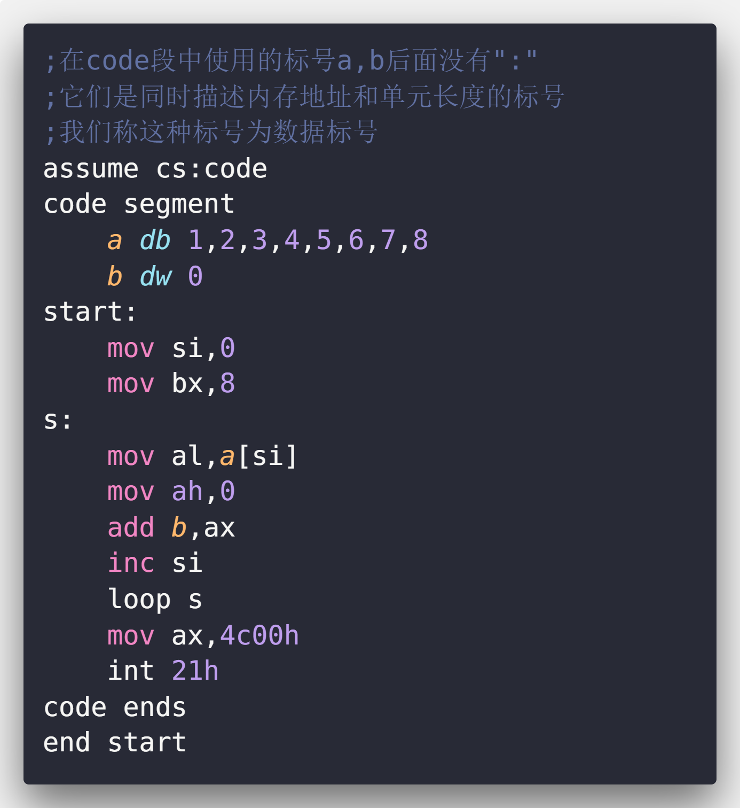

# 第十二章 内中断

通用cpu可以在执行完当前执行的指令之后，检测到从cpu外部发送过来的或内部产生的一种特殊信息，并且可以立即对所接收到的信息进行处理。这种信息叫**中断信息**。中断的信息是指，cpu不再接着向下执行，而去处理这个特殊信息。

**中断信息**是要求cpu马上进行某种处理，并向所要进行的该种处理提供了必备的参数的通知信息。

cpu的中断可以来自内部或外部。

## 1. 内中断的产生

中断源(中断信息的来源)有：

| 中断源                              |                          中断类型码                          |
| :---------------------------------- | :----------------------------------------------------------: |
| 除法错误，比如div指令产生的除法溢出 |                              0                               |
| 单步执行                            |                              1                               |
| 执行`into`指令                      |                              4                               |
| 执行`int`指令                       | 该指令的格式为`int n`<br>指令中的`n`为字节型立即数<br>n为立即码 |

## 2. 中断处理程序



## 3. 中断向量表

**中断类型码**通过**中断向量表**找到对应的**中断处理程序**的入口地址。

**中断向量表**就是**中断向量**的列表。

**中断向量**就是**中断处理程序**入口地址的。

**中断向量表**在内存中保存，其中存放着256个**中断源**所对应的中断处理程序的入口。

8086中**中断向量表**制定放在内存地址`0`处。从`0000:0000`到`0000:03ff`的`1024`个内存单元中存放着中断向量表。一个表项占两个字，高地址存`段地址`，低地址存`偏移地址`。

## 4. 中断过程

| 中断过程                                               | 简洁描述                       |
| :----------------------------------------------------- | :----------------------------- |
| 从中断信息中取得中断类型码                             | 取得中断类型码`N`              |
| 标志寄存器的值入栈<br>(中断过程中会改变标志寄存器的值) | `pushf`                        |
| 设置标志寄存器的第8位`tf`和第9位`if`的值为0            | `TF=0`<br>`IF=0`               |
| `cs`的内容入栈<br>`ip`的内容入栈                       | `push cs`<br>`push ip`         |
| 从中断向量表中读取中断处理程序的`ip`和`cs`             | `(ip)=(N*4)`<br>`(cs)=(N*4+2)` |


## 5. 中断处理程序和iret指令

中断程序的编写方法:



`iret`指令等于`pop IP`;`pop CS`;`popf`，通常和硬件自动完成的中断过程配合使用。

## 6. 除法错误中断的处理

```asm
mov ax,1000h
mov bh,1
div bh
```

除数为8位，`al`存商，1000在al中溢出。

## 7. 编程处理0号中断

程序：`do0`

功能：在发生除法溢出错误后，产生0号中断信息，cpu执行`do0`，屏幕中间提示`"overflow"`，返回到操作系统中。

问题：`do0`应放在内存中。但除法溢出随时可能发生，cpu随时可能将`cs:ip`指向`do0`,那么`do0`应该放在哪里呢？

解决：`0000:0000`~`0000:03ff`的`1024`个字节是系统存放中断处理程序的入口地址的中断像量表。但其实中断事件没有`256`个，从`0000:0200`到`0000:02ff`的`256`个字节都是空的。所以我们可以将`do0`传送到内存`0000:0200`处。将`do0`的段地址`0`放在`0000:0002`字单元中，偏移地址`200h`放在`0000:0000`字单元中。

```asm
assume cs:code

code segment
start:

	;do0安装程序,将do0的代码复制到0:0200中
	mov ax,cs
	mov ds,ax			;源段地址
	mov si,offset do0	;源偏移地址
	mov ax,0
	mov es,ax			;目的段地址
	mov di,200h			;目的偏移地址
	mov cx,offset do0end-offset do0			;传送字节数
	;"-"是编译器识别的运算符号，编译器可以用它进行两个常数的减法
	cld					;将方向标志位df置1
	rep movsb			;传送字节

	;设置中断向量表，设置0号表项
	mov ax,0
	mov es,ax
	mov word pter es:[0*4],200h
	mov word pte es:[0*4+2],0

	mov ax,4c00h
	int 21h
do0:
	jmp short do0start
	db 'overflow!'		;不是可执行代码，所以上面跳转
do0start:
	;显示字符串"overflow!"	
	mov ax,cs
	mov ds,ax
	mov si,202h			;ds:si指向字符串

	mov ax,0b800h
	mov es,ax
	mov di,12*160+36*2	;设置es:di指向显存空间的中间地址
	mov cx,9
s:
	mov al,[si]
	mov es:[di],al
	inc si
	add di,2
	loop s
	mov ax，4c00h
	int 21h

do0end:
	nop
code ends
end start
```

## 8. 单步中断

cpu在执行完一条指令后，如果检测到标志寄存器的`tf`位为1，则产生单步中断，引发中断过程。单步中断的中断类型码为1，引发的中断过程如下：



`debug`每次`t`后显示寄存器的状态就是因为`debug`提供了单步中断的中断处理程序。在使用`t`时，`debug`将tf置为1，则在cpu执行完这条指令后就引发单步中断。

cpu提供单步中断功能的原因是为单步跟踪程序的执行过程提供了实现机制。

## 9. 响应中断的特殊情况

在执行完向`ss`寄存器传送数据的指令后，即便是发生中断，cpu也不会响应。因为对`ss`和`sp`的设置应连续完成。

# 第十三章 int 指令

## 1 int 指令
格式：`int n`,`n`为中断类型码

执行过程：

1. 取中断类型码
2. 标志寄存器入栈，`if=0`，`tf=0`
3. `cs`、`ip`入栈
4. `(ip)=(n*4)`，`(cs)(n*4+2)`

int指令和call指令相似，都是调用一段程序。

```asm
;在屏幕中间显示一个!,然后显示"divide overflow"后返回系统中
assume cs:code

code segment
start:
    mov ax,0b800h
    mov es,ax
    mov byte ptr es:[12*160+40*2],'!'
    int 0
code ends
end start
```

## 2 bios和dos所提供的中断例程

bios中主要包含以下内容：

1. 硬件系统的检测和初始化程序
2. 外部中断和内部中断的中断例程
3. 用于对硬件设备进行i/o操作的中断例程
4. 其他和硬件系统相关的中断例程

dos也提供了中断例程，从操作系统的角度来看，dos中断例程就是操作系统向程序员提供的编程资源。

和硬件设备相关的dos中断例程一般都调用了bios的中断例程

## 3 bios和dos中断例程的安装过程

1. 开机，cpu加电，(cs)=0ffffh,(ip)=0,从ffff:0单元开始执行。FFFF:0处有一条跳转指令，cpu执行后，转去执行bios中的硬件系统检测和初始化程序。
2. 初始化程序将建立BIOS所支持的中断向量（将BIOS提供的中断例程的入口地址登记在中断向量表中）。
3. 硬件系统检测和初始化完成后，调用`int 19h`进行操作系统的引导。从此将计算机交由操作系统检测。
4. dos启动后，除其他工作外，将dos所提供的中断例程装入内存，并建立相应的中断向量。

## 检测点13.2

1. 我们可以改变FFFF:0处的指令，使cpu不去执行bios中的硬件系统检测和初始化程序。

答：错误,因为bios是不可写的,不能向里面写程序

2. `int 19h`中断例程，可以由dos提供

答：错误，19号中断是引导操作系统的,必须在在操作系统还没有执行前提供

## 4 BIOS中断例程的应用

`int 10h`由BIOS提供，包含多个和屏幕输出相关的子程序。

一般来说，一个供程序员调用的中断例程往往包括多个子程序，中断例程内部用传递进来的参数决定执行哪一个子程序。BIOS和DOS提供的中断例程，由`ah`来传递内部子程序的编号。

```asm
mov ah,2    ;2号子程序，功能:置光标
mov bh,0    ;第0页
mov dh,5    ;dh中放行号
mov dl,12   ;dl中放列号
int 10h
```

显示缓冲区B8000H~BFFFFH共32KB的空间,分8页，每页4KB，80*25。默认显示第0页的内容。

```asm
mov ah,9    ;在光标位置显示字符
mov al,'a'  ;字符
mov bl,7    ;颜色属性
mov bh,0    ;第0页
mov cx,3    ;字符重复个数
int 10h
```

## 5 DOS中断例程的应用

`int 21h`是DOS提供的中断例程。

```asm
;int 21h中断例程的4ch号功能：程序返回功能
mov ah,4ch
mov al,0
int 21h
```

```asm
;在光标位置显示字符串
ds:dx 指向字符串    ;以"$"作为结束符
mov ah,9            ;功能号9，在光标位置显示字符串
int 21h
```

# 第十四章 端口

各种存储器都和CPU的地址线、数据线、控制线相连。CPU在操纵他们的时候，都当做内存，把它们总地看做一个由若干存储单元组成的逻辑存储器，这个逻辑存储器我们称其为**内存地址空间**。

在PC机中，和CPU通过总线相连的芯片除各种**存储器**外，还有以下3种芯片：
1. 各种**接口卡**(比如:网卡、显卡)上的接口芯片,它们控制接口卡进行工作
2. 主板上的**接口芯片**,CPU通过它们对部分外设进行访问
3. **其他芯片**,用来存储相关的系统信息,或进行相关的输入输出处理

这些芯片都有一组可以由CPU进行读写的寄存器,这些寄存器的相同点有:
1. 都和CPU的总线相连(通过它们所在的芯片相连)
2. CPU对它们进行读或写的时候都通过控制线向他们所在的芯片发出端口读写命令

从CPU的角度,将这些寄存器都当做端口,对其统一编址,从而建立了一个统一的端口地址空间,每个端口在地址空间中都有一个地址.

CPU可以直接读写三个地方的数据:
1. CPU内部的寄存器
2. 内存单元
3. 端口

## 1 端口的读写

访问端口时,**cpu通过端口地址来定位端口**.

因端口所在的芯片和CPU通过总线相连,所以,**端口地址和内存地址一样,通过地址总线来传送**.

在PC系统中,**CPU最多定位64KB个不同的端口**,则端口的范围为0~65535.

对端口的读写**不能**用`mov`、`push`、`pop`等内存读写指令.

端口的读写指令分别为:`in`,`out`.

| 访问指令     |                                                              |
| :----------- | :----------------------------------------------------------- |
| 内存访问指令 | `mov ax,ds:[8]`<br>1.CPU通过**地址线**将地址信息8发出<br>2.CPU通过**控制线**发出**内存读命令**,选中**存储器芯片**,并通知它,将要从中读取数据<br>3.**存储器**将8号单元中的数据通过数据线送入CPU |
| 端口访问指令 | `in al,60h`<br>1.CPU通过**地址线**将地址信息60h发出<br>2.CPU通过**控制线**发出**端口读命令**,选中**端口所在的芯片**,并通知它,将要从中读取数据<br>3.**端口所在的芯片**将60h端口中的数据通过数据线送入CPU |

```asm
;对0~255以内的端口进行读写
in al,20h   ;从20h端口读入一个字节
out 20h,al  ;往20h端口写入一个字节
;对256~65535的端口进行读写时,端口号放在dx中
mov dx,3f8h ;将端口号3f8h放入dx
in al,dx    ;从3f8h端口读一个字节
out dx,al   ;往3f8h端口写一个字节
```

## 2 CMOS RAM芯片

**CMOS芯片**是一种**低功耗芯片**,其主要作用是**用来存放BIOS中的信息以及系统时间日期**.

CMOS芯片的特征:
1. 包含一个**实体钟**和一个**有128个存储单元的RAM存储器**(早期的电脑为64个字节)
2. 该芯片**靠电池供电**.所以**关机后**其内部的实时钟仍可正常工作,RAM中的**信息不丢失**.
3. 128个字节的RAM中,**内部时钟占用0~0dh单元保存时间信息**,其余**大部分单元用于保存系统配置信息**,供系统启动时BIOS程序读取.BIOS也提供了相关的程序,使我们可以在开机的时候配置CMOS RAM的系统信息.
4. 该芯片**内部有两个端口**,**地址**为**70h**和**71h**.CPU通过这两个端口读写CMOS RAM
5. **70h为地址端口**,存放要访问的CMOS RAM单元的地址;**71h为数据端口**,存放选定的CMOS RAM单元中读取的数据,或要写入其中的数据.可见,CPU对CMOS RAM的读写分两步进行,比如,*读CMOS RAM的2号单元*:
    1. 将2送入端口70h
    2. 从端口71h读出2号单元的地址

## 3 shl和shr指令

shl和shr是逻辑移位指令:

1. `shl`是逻辑左移指令,格式为:`shl reg/mem,1/cl`功能为:
    1. 将一个寄存器或内存单元中的数据向左移位
    2. 将最后移出的一位写入`cf`中
    3. 最低位用0补充
    4. 移动位数大于1时,必须将移动位数放在`cl`中
2. `shr`是逻辑右移指令,格式为:`shr reg/mem,1/cl`功能为:
    1. 将一个寄存器或内存单元中的数据向右移位
    2. 将最后移出的一位写入`cf`中
    3. 最高位用0补充
    4. 移动位数大于1时,必须将移动位数放在`cl`中

## 4 CMOS RAM中存放的时间信息

在CMOS RAM中,存放着当前的时间:年,月,日,时,分,秒.这6个信息的长度都为1字节,存放单元为:秒:0,分:2,时:4,日:7,年:9.(以BCD码存放)

BCD码:数值26的BCD码是`0010 0110`.一个字节可以表示两个BCD码.

编程:在屏幕中间显示当前月份:[month.asm](./month.asm)

```asm
assume cs:code

code segment
start:
    mov al,8
    out 70h,al
    in al,71h   ;获得当前月份的BCD码

    mov ah,al
    mov cl,4
    shr ah,cl   ;ah为月份的十位数BCD码
    and al,00001111b;al为月份的个位数BCD码
    
    add ah,30h
    add al,30h

    mov bx,0b800h
    mov es,bx
    mov byte ptr es:[160*12+40*2],ah
    mov byte ptr es:[160*12+40*2+2],al

    mov ax,4c00h
    int 21h

code ends
end start
```
# 第十五章 外中断

CPU除了能执行指令,进行运算,还能对外部设备进行控制,接收其输入,向其进行输出.

要及时处理外设的输入需要解决:

1. 外设的输入随时可能发生,CPU如何得知
2. CPU从何处得到外设的输入

## 1 接口芯片和端口

CPU通过端口和外部设备进行联系

## 2 外中断信息

问:外设随时可能发生需要CPU及时处理的事件,CPU是如何得知并进行处理

答:CPU提供中断来满足这种需求.

| 中断分类 |                                                              |
| :------- | :----------------------------------------------------------- |
| 内部中断 | 当CPU的内部有需要处理的事情发生时,将产生中断信息,引发中断过程 |
| 外部中断 | 当CPU的外部部有需要处理的事情发生时(比如:外设的输入到达,相关芯片将向CPU发出相应的终端信息),CPU在执行完当前的指令后,可以检测到大送过来的中断信息,引发中断过程,处理外设的输入 |

| 外中断源<br>的种类 | 可屏蔽中断                                                   | 不可屏蔽中断                                                 |
| :----------------- | :----------------------------------------------------------- | :----------------------------------------------------------- |
| 含义               | **CPU可以不响应的中断**<br>检测到可屏蔽中断信息时,如果标志寄存器`IF=1`,则CPU在执行完当前指令后响应中断<br>`IF=0`,则不响应可屏蔽中断 | **CPU必须相应的外中断**                                      |
| 中断过程           | 与内中断过程除第一步略有不同,基本和内中断相同<br>`IF`置`0`的原因是,在进入中断处理程序后,禁止其他的可屏蔽中断<br>如果在进入中断处理程序中需要处理可屏蔽中断可将`IF`置为1<br>`sti`设置`IF=1`<br>`cli`设置`IF=0` | 不可中断类型码固定为2,所以中断过程中不需要取中断码<br>1.标志寄存器入栈,`IF=0`,`TF=0`<br>2.CS,IP入栈<br>3.(IP)=8,(CS)=(0AH) |
| 常见中断           | 几乎所有由外设引发的外中断都是可屏蔽中断                     | 当外设有需要处理的事情(比如键盘输入)时,相关芯片向CPU发出可屏蔽中断信息 |

## 3 PC机键盘的处理过程

### 3.1 键盘的输入

键盘上的每一个键相当于一个开关，键盘中有一个芯片对每个键的开关状态进行扫描。

每按下一个键，开关接通，该芯片产生一个扫描码，**扫描码**说明了按下的键在键盘上的位置。扫描码被送入主板上的相关接口芯片的寄存器中，该寄存器的端口地址为`60h`。

松开按下的键时，也产生一个扫描码，扫描码说明了松开的键在键盘上的位置。松开按键时产生的扫描码也被送入`60h`端口中。

一般将按下一个键时产生的扫描码称为**通码**，松开一个键产生的扫描码称为**断码**。扫描码长度为一个字节，**通码的第7位为0，断码的第7位为1**，即：**断码=通码+80h**




### 3.2 引发9号中断

键盘的输入到达`60h`端口时，相关的芯片就会向CPU发出中断类型码为9的可屏蔽中断信息。CPU检测到该中断信息后，如果IF=1，则响应中断，引发中断过程。

### 3.3 执行int9中断例程

BIOS提供了`int 9`中断例程，用来进行基本的键盘处理。主要工作有：

1. 读出`60h`端口中的扫描码
2. 如果是字符键的扫描码，将该扫描码和它对应的字符码送入内存中的BIOS键盘缓冲区；如果是控制键（eg：ctrl）和切换键（eg：CapsLock）的扫描码，则将其转变为**状态字节**（**用二进制位记录控制键和切换键状态的字节**）写入内存中存储状态字节的单元。
3. 对键盘系统进行相关的控制。比如说：向相关芯片发出应答信息。

**BIOS键盘缓冲区**是系统启动后，BIOS用于存放`int 9`中断例程所接收的键盘输入的**内存区**。该内存区可以存储15个键盘输入，因为`int 9`中断例程除了接收扫描码外，还要产生和扫描码对应的字符码，所以在BIOS键盘缓冲区中，**一个键盘输入用一个字单元存放，高位字节存放扫描码，低位字节存放字节码**。

`0040:17`单元存储**键盘状态字节**,该字节**记录了控制键和切换键的状态**.键盘状态字节各位记录如下:



## 4 编写int 9中断例程

键盘输入的处理过程:键盘产生扫描码→扫描码送入60端口→引发9号中断→CPU执行int 9中断例程处理键盘输入

我们可以编写`int 9`键盘中断例程,按照自己的意图来处理键盘的输入.因为BIOS提供的`int 9`中断例程已经对这些硬件细节进行了处理,我们只要在自己编写的中断例程中调用BIOS的`int 9`中断例程就可以了.

编程:在屏幕中间依次显示"a"~"z",并可以让人看清.在显示的过程中,按下<kbd>esc</kbd>键后改变显示的颜色.

键盘输入到达` 60h `端口后,就会引发` 9 `号中断,CPU转去执行` int 9 `中断例程.我们可以编写如下的` int 9 `中断例程:

1. 从` 60h `端口中读出键盘的输入:` in al,60h `
2. 调用bios的` int 9 `中断例程,处理其他硬件细节
3. 判断是否为<kbd>Esc</kbd>的扫描码,如果是,改变显示的颜色后返回,如果不是则直接返回.在程序返回前,将中断向量表中的` int 9 `的中断例程的入口地址恢复为原来的地址,否则程序返回后,别的程序无法使用键盘.

```asm
;kbdaz.asm
assume cs:code

stack segment
    db 128 dup (0)
stack ends

data segment
    dw 0,0
data ends

code segment
start:
    mov ax,stack
    mov ss,ax
    mov sp,128

    mov ax,data
    mov ds,ax

    mov ax,0
    mov es,ax

    push es:[9*4]
    pop ds:[0]
    push es:[9*4+2]
    pop ds:[2];将原来的int 9中断例程的入口地址保存在ds:0,ds:2中

    mov word ptr es:[9*4],offset int9
    mov es:[9*4+2],cs;在中断向量表中设置新的int 9中断例程的入口地址

    mov ax,0b800h
    mov es,ax
    mov ah,'a'
s:
    mov es:[160*12+40*2],ah
    call delay
    inc ah
    cmp ah,'z'
    jna s

    mov ax,0
    mov es,ax

    push ds:[0]
    pop  es:[9*4]
    push ds:[2]
    pop es:[9*4+2];将中断向量表中int 9中断例程的入口地址恢复为原来的地址

    mov ax,4c00h
    int 21h

delay:
    push ax
    push dx
    mov dx,10h;循环10000000次
    mov ax,0
s1:
    sub ax,1
    sbb dx,0
    cmp ax,0
    jne s1
    cmp dx,0
    jne s1
    pop dx
    pop ax
    ret

int9:
    push ax
    push bx
    push es

    in al,60h

    pushf
    pushf
    pop bx
    and bh,11111100b
    push bx
    popf
    call dword ptr ds:[0];对int指令进行模拟,调用原来的int 9中断例程

    cmp al,1
    jne int9ret

    mov ax,0b800h
    mov es,ax
    inc byte ptr es:[160*12+40*2+1];改变颜色

int9ret:
    pop es
    pop bx
    pop ax
    iret

code ends
end start
```

## 5 安装新的int 9中断例程

任务:安装一个新的` int 9 `中断例程

功能:在DOS下,按<kbd>F1</kbd>改变当前屏幕的显示颜色,其他的键照常处理

分析:

| 功能                              | 实现                                                         |
| :-------------------------------- | :----------------------------------------------------------- |
| 改变屏幕的颜色                    | 改变从B8000H开始的4000个字节的所有奇地址单元中的内容         |
| 其他键照常处理                    | 调用原` int 9 `中断处理程序,来处理其他键盘输入               |
| 原` int 9 `中断例程入口地址的保存 | 新的` int 9 `中断例程需要调用原` int 9 `中断例程,所以,要保存原` int 9 `中断例程的入口地址<br>因为安装程序返回后地址将丢失,我们将地址保存在` 0:200 `单元处 |
| 新的` int 9 `中断例程的安装       | 新的` int 9 `中断例程安装在` 0:204 `处                       |

```asm
;csc.asm==changeScreenColor.asm
assume cs:code

stack segment
    db 128 dup (0)
stack ends

code segment
start:
    mov ax,stack
    mov ss,ax
    mov sp,128

    push cs
    pop ds

    mov ax,0
    mov es,ax

    mov si,offset int9
    mov di,204h
    mov cs,offset int9end-offset int9
    cld
    rep movsb

    push es:[9*4]
    pop es:[200h]
    push es:[9*4+2]
    pop es:[202h]

    cli
    mov word ptr es:[9*4],204h
    mov word ptr es:[9*4+2],0
    sti

    mov ax,4c00h
    int 21h

int9:
    push ax
    push bx
    push cx
    push dx

    in al,60h

    pushf
    call dword ptr cs:[200h];当此中断时执行0:200

    cmp al,3bh;F1的扫描码是3bh
    jne int9ret

    mov ax,0b800h
    mov es,ax
    mov bx,1
    mov cx,2000
s:
    int byte ptr es:[bx]
    add bx,2
    loop s
int9ret:
    pop es
    pop cx
    pop bx
    pop ax
    iret
int9end:
    nop
code ends
end start
    
```

CPU处理外设输入的通常处理方法:

1. 外设的输入送入端口
2. 向CPU发出外中断(可屏蔽中断)信息
3. CPU检测到可屏蔽中断信息,如果` IF=1 `,CPU在执行完当前指令后响应中断,执行相应的中断例程
4. 可在中断例程中实现对外设输入的处理


**端口和中断机制,是CPU进行I/O的基础**


# 第十六章 直接定址表

## 1 描述了单元长度的标号

|       地址标号        |       数据标号        |
| :-------------------: | :-------------------: |
|  |  |

## 2 在其他段中使用数据标号

一般来说,我们将数据定义带非代码段.在这些段中,我们也可以使用数据标号来描述存储数据的单元的地址和长度.**在后面加有":"的地址标号,只能在代码段中使用,不能在其他段中使用**

```
;将data段中a标号处的8个数据累加
;结果存储到b标号处的字中
assume cs:code,ds:data
data segment
    a db 1,2,3,4,5,6,7,8
    b dw 0
data ends
code segment
start:
    mov ax,data
    mov ds,ax

    mov si,0
    mov cx,8
s:
    mov al,a[si];编译为:mov al,[si+0]
    ;如果想在代码段中直接使用数据标号访问数据
    ;需要用伪指令assume将标号所在的段和一个段寄存器联系起来
    ;否则在编译的时候无法确定标号的段地址在哪个寄存器
    ;还需要在程序中使用指令对该段寄存器进行设置
    mov ah,0
    add b,ax;编译为:mov [8],ax
    ;直接用数据标号访问数据
    inc si
    loop s

    mov ax,4c00h
    int 21h
code ends
end start
```

可以**将标号当做数据来定义**,此时,编译器将**标号所表示的地址当做数据的值**.

```
data segment
    a db 1,2,3,4,5,6,7,8
    b dw 0
    c dw a,b;c dw offset a,offset b
    ;数据标号c处存储的两个字型数据为标号a,b的偏移地址
    d dd a,b;d dd offset a,seg a,offset b,seg b
    ;数据标号d处存储的两个双字型数据为标号a,b的偏移地址和段地址
data ends
```

## 3 直接定址表

使用查表的方法编写相关程序的技巧

编写子程序:以16禁止的形式在屏幕中间显示给定的字节型数据

分析:一个字节需要用两个16进制数码来表示,所以子程序需要在屏幕上显示两个"0~F"的字符

流程:将一个字节的高4位和低4位分开,如果数值为0,则显示0,依次类推.但是这样程序中要使用多条比较,转移指令.程序长且混乱.我们可以建立一张表,表中依次存储"0~~F",我们通过数值0~~15直接查找对应的字符.

```
;子程序如下
;用al传送要显示的数据
showbyte:
    jmp short show
    table db '0123456789ABCDEF'
show:
    push bx
    push es
    
    mov ah,al
    shr ah,1
    shr ah,1
    shr ah,1
    shr ah,1;右移4位,ah中得到高4位的值
    and al,00001111b;al中为低4位的值
    mov bl,ah
    mov bh,0
    mov ah,table[bx];相当于table的偏移地址
    
    mov bx,0b800h
    mov es,bx
    mov es:[160*12+40*2],ah
    
    mov bl,al
    mov bh,0
    mov al,table[bx]

    mov es:[160*12+40*2+2],al
    
    pop es
    pop bx
    ret
```

## 4 程序入口地址的直接定址表

我们可以在直接定址表中存储子程序的地址,从而方便地实现不同子程序的调用.


# 第十七章 使用 BIOS 进行键盘输入和磁盘读写

1. 大多数有用的程序都需要处理用户的输入，键盘输入是最基本的输入。
2. 程序和数据通常需要长期存储，磁盘是最常用的存储设备。BIOS为这两种外设的I/O提供了最基本的中断例程。

## 1. int9中断例程对键盘输入的处理

键盘输入将引发9号中断，BIOS提供了`int 9`中断例程。CPU在9号中断发生后，执行`int 9`中断例程，从`60h`端口读出扫描码，并将其转化为相应的ASCII码或状态信息，存储在内存的指定空间(键盘缓冲区或状态字节)中。

一般的键盘输入，在CPU执行完`int 9`中断例程后，都放到了键盘缓冲区中。键盘缓冲区中有16个字单元，可以存储15个按键的扫描码和对应的ASCII码。

## 2. 使用int 16h中断例程读取键盘缓冲区

BIOS提供了`int 16h`中断例程供程序员调用。`int 16h`中断例程中包含的**一个最重要的功能是从键盘缓冲区中读取一个键盘输入**，该功能的编号为`0`。下面的指令从键盘缓冲区中读取一个键盘输入，并且将其从缓冲区中删除。

```asm
mov ah，0
int 16h
;结果: (ah)=扫描码，(al)=ASCII码
```

`int 16h`中断例程检测键盘缓冲区，发现缓冲区空，则循环等待，直到缓冲区中有数据。

`int 16h`中断例程的`0`号功能，进行如下的工作：

1. 检测键盘缓冲区中是否有数据；
2. 没有则继续做第1步；
3. 读取缓冲区第一个字节单元中的键盘输入；
4. 将读取的扫描码送入ah，ASCII码送入al；
5. 将已读取的键盘输入从缓冲区中删除。

```asm
;接收用户的键盘输入
;输入r,将屏幕上的字符设置为红色
;输入g,将屏幕上的字符设置为绿色
;输入b,将屏幕上的字符设置为蓝色
CODES SEGMENT
    ASSUME CS:CODES
START:
	MOV AH,0
	INT 16H 	;读取键盘缓冲区的数据
	
	MOV AH,1	;这边是设置初始颜色为蓝色的吧
	CMP AL,'r'
	JE RED
	CMP AL,'g'
	JE GREEN
	CMP AL,'b'
	JE BLUE
	JMP SHORT SRET
	
RED:
	SHL AH,1	;如果我们输入的是R，那么这边AH左移两位（下面还有SHL AH,1）是00000100
	;这在颜色属性中就是红色
	
GREEN:
	SHL AH,1	;如果是绿色的，只要蓝色属性左移一位便可以
	
BLUE:
	MOV BX,0B800H
	MOV ES,BX
	MOV BX,1
	MOV CX,2000
S:
	AND BYTE PTR ES:[BX],11111000B
	OR ES:[BX],AH
	ADD BX,2
	LOOP S
	JMP SHORT START
	
SRET:
    MOV AH,4CH
    INT 21H
CODES ENDS
END START
```

## 3. 字符串的输入

最简单的字符串输入程序，需要具备下面的功能:

1. 在输入的同时需要显示这个字符串；
2. 一般在输入回车符后，字符串输入结束；
3. 能够删除已经输入的字符。


以栈的方式处理字符串的输入，需要的功能有入栈、出栈、显示。

## 4. 应用int13h中断例程对磁盘进行读写
1. 3.5英寸软盘分为上下两面，每面有80个磁道，每个磁道又分为18个扇区，每个扇区的大小为512个字节。则:`2面*80磁道*18扇区*512字节=1440KB~=1.44MB`
2. 磁盘的实际访问由磁盘控制器进行，我们可以通过控制磁盘控制器来访问磁盘。只能以扇区为单位对磁盘进行读写。在读写扇区的时候，要给出面号、磁道号和扇区号。**面号和磁道号从0开始，而扇区号从1开始。**
3. 如果我们通过直接控制磁盘控制器来访问磁盘，则需要涉及许多硬件细节。BIOS提供了对扇区进行读写的中断例程，这些中断例程完成了许多复杂的和硬件相关的工作。我们可以通过调用BIOS中断例程来访问磁盘。
4. BIOS提供的访问磁盘的中断例程为`int 13h`

